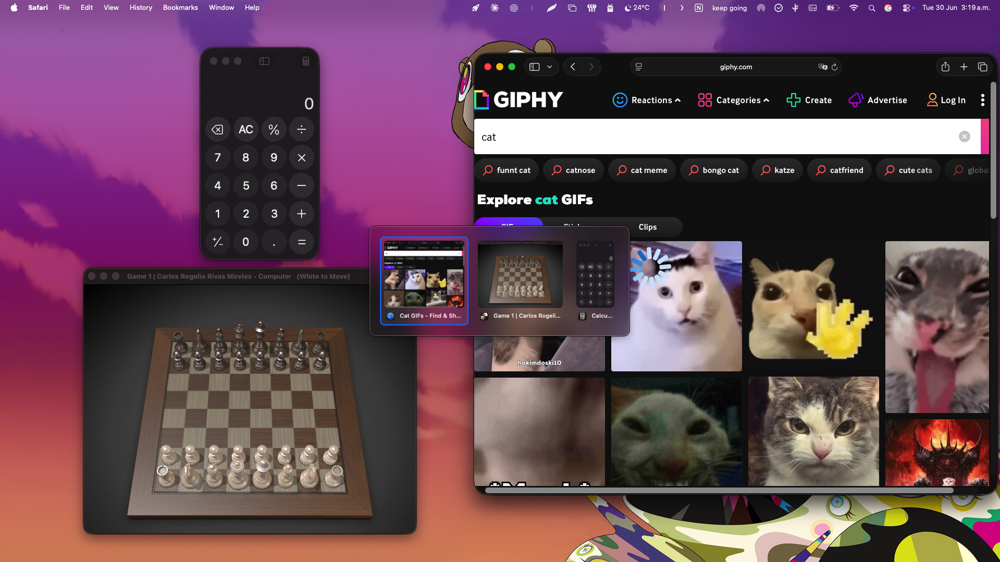

# Switcher

A free, open-source window switcher for macOS.



Hold **⌥ Tab** to bring up a grid of your open windows with live previews, tap Tab to cycle,
and release to switch.

## Installation

1. Download the latest release from [Releases](https://github.com/rogedev/switcher/releases)
2. Unzip it and drag **Switcher.app** to your **Applications** folder
3. **First launch — clear the macOS security warning.** Switcher is open-source and isn't
   signed with a paid Apple Developer certificate, so on first open macOS Gatekeeper shows
   *"Apple could not verify Switcher is free of malware…"*. Remove the download quarantine
   flag once and it opens normally from then on:

   ```bash
   xattr -dr com.apple.quarantine /Applications/Switcher.app
   ```

   Then open Switcher from Applications. _Alternatively:_ try to open it, then go to
   **System Settings → Privacy & Security**, scroll to the *Security* section, and click
   **"Open Anyway"**.
4. Switcher appears as an icon in your menu bar
5. Grant the permissions it asks for (see below)

## Permissions

| Permission | Why | When it's asked |
|---|---|---|
| **Accessibility** | To open the switcher and to focus/raise windows when you select them | On first launch (required) |
| **Screen Recording** | To show live window thumbnails and per-window titles | Only when you turn on **Window Previews** |

By default Switcher runs in **App Icons** mode, which needs no Screen Recording — so on
first launch you'll only be asked for **Accessibility**. Screen Recording is requested the
first time you switch to **Window Previews**. After you've granted it, you can flip between
icons and previews freely with no further prompts.

Enable permissions under **System Settings → Privacy & Security**, in the **Accessibility**
and **Screen & System Audio Recording** sections.

> **Note:** the very first time you grant Screen Recording, macOS may require you to quit and
> reopen Switcher before previews start rendering. This is a one-time macOS limitation.

## Settings

Open the menu bar icon to configure:

| Setting | Options | Notes |
|---|---|---|
| **Shortcut** | `⌥ Tab` (default) · `⌘ Tab` | `⌘ Tab` replaces the built-in macOS app switcher while Switcher is running |
| **Display** | `App Icons` (default) · `Window Previews` | Previews show live thumbnails and need Screen Recording |

Your choices are remembered between launches.

## How to Use

| Shortcut | Action |
|---|---|
| **⌥ Tab** | Open switcher / cycle forward |
| **⌥ ⇧ Tab** | Cycle backward |
| **Arrow keys** | Navigate the grid |
| **Release ⌥** | Switch to the selected window |
| **Escape** | Cancel |

Hold the modifier, tap Tab to cycle through windows, release the modifier to switch.
That's it. (If you set the shortcut to **⌘ Tab** in the menu, use Command instead of Option
throughout.)

## Building from Source

Requires macOS 13+, Xcode 16+, and [XcodeGen](https://github.com/yonaskolb/XcodeGen).

```bash
brew install xcodegen
xcodegen generate
xcodebuild -project Switcher.xcodeproj -scheme Switcher build
```

## License

MIT
